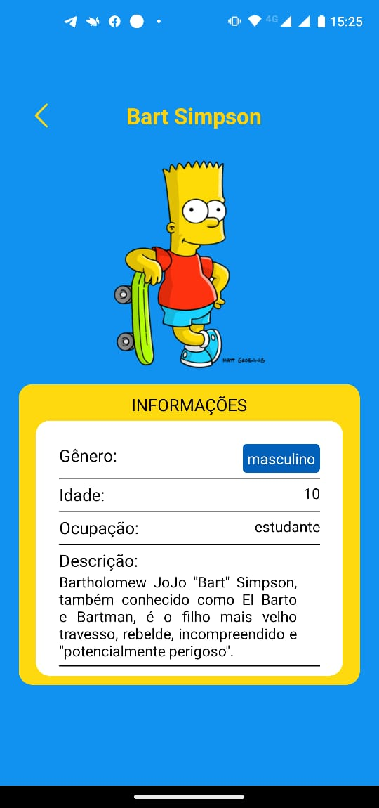

<h1 align="center">
    Simpsons Family App
</h1>

<div align="center">
   <a href="https://github.com/JohnPetros">
      
   </a>
   
   <a href="https://github.com/JohnPetros/simpsons-family/commits/main">
      
   </a>
  </a>
   </a>
   <a href="https://github.com/JohnPetros/simpsons-family/blob/main/LICENSE.md">
      
   </a>
    
</div>

<br>

## 🖥️ Projeto

Aplicativo mobile sobre os integrantes da família Simpson, apresentando informações descritivas da cada personagem (nome, gênero, idade e ocupação). O app somente possui 2 telas: uma que contém os cards referentes a cada Simpson, e outra que exibe os dados do personagem escolhido pelo usuário, que são renderizados dinamicamente. Este projeto foi desenvolvido como dever de casa para a disciplina de programação mobile na Etec com o intuito de treinar o conceito de FlatList em React Native, que nada mais é um componente próprio para renderização de listas

### Demonstração
<div align="center">
    
    
    
    
    
    
</div>
<hr>


## 📖 Aprendizado

- Renderização em lista com FlatList
- Uso da função map do JavaScript para renderizar itens dinamicamente
- Passagem de dados entre componentes através de propriedades e de parâmetros de rotas
- Conceito de elevação de state
- Cópia de dados de arrays para componentes usndo o spread operator
- Inserção de elementos filhos em um componente
- Estilização condicional a partir de propriedades de componentes
- Estilização da barra de status do dispositivo
- Consumo de dados de um arquivo JavaScript externo

<hr>

## 🚀 Tecnologias

Esse projeto foi desenvolvido com as seguintes tecnologias:

- **[React Native](https://expo.io/)**
- **[Expo](https://expo.io/)**

## Como rodar este projeto

### Pré-requesitos

Antes de baixar o projeto você vai precisar ter instalado na sua máquina as seguintes ferramentas:

- [Git](https://git-scm.com)
- [NodeJS](https://nodejs.org/en/)
- [Yarn](https://yarnpkg.com/) ou [NPM](https://www.npmjs.com/)

Além disto é bom ter um editor para trabalhar com o código como [VSCode](https://code.visualstudio.com/)<br>

> Você poder executar o App no seu celular ou em um emulador de celular da sua preferência usando Expo, ou ainda pela plataforma web do Expo acessando este link: [expo.dev](expo.dev](https://expo.dev)).

#### 📟 Rodando o Mobile

```bash
# Clone este repositório
$ git clone  https://github.com/JohnPetros/simpsons-family.git

# Acesse a pasta do projeto no terminal/cmd
$ cd simpsons-family

# Instale as dependências
$ npm install

# Execute a aplicação em modo de desenvolvimento
$ npx expo start

```
---

## :memo: Licença

Esse projeto está sob a licença MIT. Veja o arquivo [LICENSE](LICENSE) para mais detalhes.

---

Feito com 💜 by João Pedro 👋🏻
